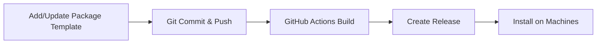

# Void Linux Custom Packages Repository

A personal repository for custom Void Linux package templates with automated builds via GitHub Actions.

Packages included are: 

- hip-runtime-amd
- hipcc
- rocm-cmake
- rocm-comgr
- rocm-device-libs
- rocm-opencl
- rocminfo
- rocr-runtime
- vscode-bin
- zen-browser

## 📦 What's This?

This repository hosts custom package templates for Void Linux, including ROCm packages and other custom builds. Packages are automatically built via GitHub Actions and published as releases, making it easy to install on multiple machines.

## 🚀 Quick Start

### On a New Machine

1. **Add this repository as a package source:**
   ```bash
   ./scripts/setup-repo.sh https://github.com/markupstart/voidrepo/releases/download/latest
   ```

2. **Install packages:**
   ```bash
   sudo xbps-install -S your-package-name
   ```

### For Development

1. **Clone this repository:**
   ```bash
   git clone https://github.com/markupstart/voidrepo.git
   cd voidrepo
   ```

2. **Bootstrap the build environment:**
   ```bash
   ./scripts/bootstrap.sh
   ```

3. **Build all packages:**
   ```bash
   ./scripts/build-all.sh
   ```

## 📁 Repository Structure

```
voidrepo/
├── srcpkgs/              # Custom package templates (your packages go here)
│   ├── rocm/
│   ├── rocm-llvm/
│   └── ...
├── binpkgs/              # Built packages (generated, not committed)
├── scripts/
│   ├── bootstrap.sh      # Set up build environment
│   ├── build-all.sh      # Build all custom packages
│   └── setup-repo.sh     # Configure machine to use this repo
├── .github/workflows/
│   └── build-packages.yml # Automated builds
└── void-packages/        # Cloned during bootstrap (not committed)
```

## 🔧 Adding a New Package

1. **Create package template in `srcpkgs/`:**
   ```bash
   mkdir srcpkgs/mypackage
   ```

2. **Create the template file** `srcpkgs/mypackage/template`:
   ```bash
   # Template file
   pkgname=mypackage
   version=1.0.0
   revision=1
   build_style=gnu-configure
   short_desc="Description of my package"
   maintainer="Your Name <your@email.com>"
   license="GPL-3.0-or-later"
   homepage="https://example.com"
   distfiles="https://example.com/mypackage-${version}.tar.gz"
   checksum=abc123...
   ```

3. **Commit and push:**
   ```bash
   git add srcpkgs/mypackage
   git commit -m "Add mypackage"
   git push
   ```

4. **GitHub Actions will automatically build** and create a release!

## 🏗️ Manual Building

### Build a specific package:
```bash
cd void-packages
./xbps-src pkg mypackage
```

### Build all custom packages:
```bash
./scripts/build-all.sh
```

### Clean build environment:
```bash
cd void-packages
./xbps-src clean
```

## 📦 Using Built Packages

### Option 1: From GitHub Releases (Recommended)

Configure your system to use this repository:
```bash
./scripts/setup-repo.sh https://github.com/YOURUSERNAME/voidrepo/releases/download/latest
sudo xbps-install -S mypackage
```

### Option 2: Manual Installation

Download from [Releases](https://github.com/YOURUSERNAME/voidrepo/releases) and install:
```bash
sudo xbps-install -y ./mypackage-1.0.0_1.x86_64.xbps
```

### Option 3: Local Build

```bash
./scripts/build-all.sh
sudo xbps-install -y binpkgs/mypackage-*.xbps
```

## 🔄 Workflow



1. **Add or update** package templates in `srcpkgs/`
2. **Commit and push** to GitHub
3. **GitHub Actions automatically builds** packages
4. **Releases are created** with built `.xbps` files
5. **Install on any machine** using `xbps-install`

## 📝 Notes

### Large Files (ROCm, etc.)

For large packages like `rocm-llvm`:
- Template files are small and committed to git
- Built `.xbps` packages are hosted on GitHub Releases
- Git LFS is configured for binary files (see `.gitattributes`)

### Repository Index

The repository index (`*-repodata`) is automatically created and included in releases. This allows `xbps-install` to query available packages.

### Architecture

Packages are built for the architecture of the build machine. The GitHub Actions workflow uses `void-buildroot-musl` which builds for `x86_64-musl`.

To build for different architectures, modify the workflow to use:
- `void-buildroot-glibc` for glibc-based systems
- Cross-compilation tools for other architectures

## 🛠️ Troubleshooting

### Build fails in GitHub Actions
- Check the Actions tab for build logs
- Ensure template syntax is correct
- Verify dependencies are available in void-packages

### Package not found when installing
- Run `sudo xbps-install -S` to update the package index
- Verify the repository URL is correct in `/etc/xbps.d/`
- Check that the package was successfully built and released

### Bootstrap fails
- Ensure you're on Void Linux
- Install base-devel: `sudo xbps-install -y base-devel`
- Check network connectivity for cloning void-packages

## 📚 Resources

- [Void Linux Package Documentation](https://github.com/void-linux/void-packages/blob/master/Manual.md)
- [XBPS Package Manager](https://docs.voidlinux.org/xbps/index.html)
- [Creating Packages](https://github.com/void-linux/void-packages#creating-packages)

## 📄 License

See individual package licenses. Repository infrastructure is MIT licensed.
